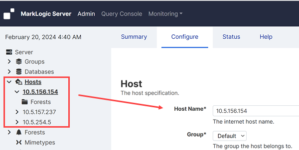

## **LUX Backend Deployment**

In this document:

- [Local Deployment](#local-deployment)
- [Dependencies and Prerequisites](#dependencies-and-prerequisites)
- [Gradle Properties](#gradle-properties)
- [Gradle Passwords](#gradle-passwords)
- [Custom Token Replacement](#custom-token-replacement)
- [Deploy Entire Backend](#deploy-entire-backend)
- [Deploy Code Changes](#deploy-code-changes)
- [Regenerate Data Constants](#regenerate-data-constants)
- [Regenerate Remaining Search Terms](#regenerate-remaining-search-terms)
- [Regenerate Related Lists Configuration](#regenerate-related-lists-configuration)
- [Regenerate Advanced Search Configuration](#regenerate-advanced-search-configuration)
- [Deploy Database Configuration Changes](#deploy-database-configuration-changes)
- [Deploy Thesauri](#deploy-thesauri)
- [Remove the Project](#remove-the-project)
- [LUX MarkLogic Application Servers](#lux-marklogic-application-servers)
- [Trace Events](#trace-events)
  - [Custom Trace Events](#custom-trace-events)
  - [Other Trace Events of Interest](#other-trace-events-of-interest)

Related documentation:

- [Gradle Tips & Tricks](/docs/lux-backend-build-tool-and-tasks.md#gradle-tips--tricks)
- [LUX Backend Local Developer Environment](/docs/lux-backend-setup-local-env.md)

# Local Deployment

To deploy locally, start with the [LUX Backend Local Developer Environment](/docs/lux-backend-setup-local-env.md) document

# Dependencies and Prerequisites

What follows is a mix of deployment and runtime dependencies and prerequisites for the target environment.

1. MarkLogic 11.0.3 is installed.
2. The MarkLogic host name is compatible with MarkLogic Content Pump (MLCP).  The default may not be.  This is set from within the MarkLogic Admin console; see the screenshot below.  Single node, local environments may use "localhost".  MarkLogic clusters in AWS may use the attached ENI IP addresses.

    

3. Network exposes the ports for the [LUX MarkLogic Application Servers](#lux-marklogic-application-servers).
4. Clone of the LUX Backend repo, with the correct branch checked out.  New clone?  You may need to allow `gradlew` to execute: `chmod 744 gradlew`.
5. Many of the deployment steps use [Gradle Build Tool](https://gradle.org/) tasks. Gradle doesn't require any set up, as it should be downloaded for you if you use the gradle wrapper script (`gradlew`). However, Java is a prerequisite for running Gradle tasks.  The version required can vary based on usage.  The `JAVA_HOME` environment variable may need to be set --Gradle will produce an error in a subsequent step, when the environment variable is required but not set.

    ```
    java version "1.8.0_281"
    Java(TM) SE Runtime Environment (build 1.8.0_281-b09)
    Java HotSpot(TM) 64-Bit Server VM (build 25.281-b09, mixed mode)
    ```

6. If planning to run MLCP from the command line (vs. via Gradle), [download](https://server.marklogic.com/products/mlcp) and install the MLCP version that aligns with the MarkLogic Server version.

# Gradle Properties

One may view all of the properties set in `gradle.properties` as the defaults and those in `gradle-[env].properties` as the overrides.  It makes for cleaner properties files if the environment-specific files only set properties for which they need to override the default.  You can also always check the resolved property values via `./gradlew properties -PenvironmentName=[env]` with an optional `grep` command to narrow down what you're looking to verify.

If you are creating your local environment, consider starting by copying `gradle-local-template.properties` as `gradle-local.properties`, then editing from there.

Group-level cache, forest topology, and volume topology property values will typically vary between local and shared environments.

Properties related to infrequently used LUX Gradle tasks should be reviewed before each run (e.g., `importDataFull` and `copyDatabase`).

This project provides multiple ML Gradle configuration directories.  They are listed and described within [LUX Backend Repository Inventory](/docs/lux-backend-repo-inventory.md).  The associated properties are `mlConfigPaths` and `mlModulePaths`.

Passwords should not be set in the properties files. See the step below about storing encrypted passwords for use with Gradle tasks.

# Gradle Passwords

Passwords to be used with Gradle tasks are to be encrypted at the command line using https://github.com/etiennestuder/gradle-credentials-plugin's `addCredentials` task: `./gradlew addCredentials --key [passwordPropertyName] --value '[yourPassword]'`.  *Note the use of single quotes around the value --they ensure the entire value is received.*  

Run `./gradlew printCredentials` to verify the correct values were received .  For your eyes only.

The `[passwordPropertyName]` keys are:

   * `mlPassword`: Required.  Expect a 401 when invalid credentials are used.
   * `copyDatabaseInputPassword` and `copyDatabaseOutputPassword`: Only required by the `copyDatabase` task.
   * `importDataPassword`: Only required by the `importData*` tasks.

Note the `luxEndpointConsumerPassword` password may be set directly in the properties file.  It is only used when `mlConfigPaths` includes [/src/main/ml-config/base-unsecured](/src/main/ml-config/base-unsecured) and running `mlDeployUsers` or above.  If not set under these conditions, an error is thrown.

 Encrypted passwords may need to be updated when switching between environments.

# Custom Token Replacement

This project defines the `preprocessMarkLogicConfigurationFiles` Gradle task.  The task is responsible for replacing one or more custom tokens.  This feature was introduced in order to share database index settings between two content databases.  Unlike the native token feature, the custom token feature enables one to replace the token reference with JSON.

To help differentiate custom token references from native token references, custom token references are surrounded by `@@`, as opposed to `%%`.

Custom token references are presently only supported within `/src/main/ml-config-*`.

To utilize, one must configure ML Gradle to use the ML configuration directories copied within `/build/main`, as that is where the Gradle task copies the ML configuration files before replacing the custom token references.  As an example, the following setting in the target environment's Gradle properties file will result in ML Gradle using `/src/main/ml-config/base` and `/src/main/ml-config/base-secured` but only after the `preprocessMarkLogicConfigurationFiles` task copies them within `/build/main` and replaces all supported custom token references.

```
mlConfigPaths=build/main/ml-config/base,build/main/ml-config/base-secured
```

The following table is to define all supported custom tokens.

| Custom Token Reference | Description |
| ---------------------- | ----------- |
| `@@contentDatabaseConfGenerated@@` | Reference is replaced with the top-level properties found in [/config/contentDatabaseConfGenerated.json](/config/contentDatabaseConfGenerated.json). |

# Deploy Entire Backend

*Note: Don't always believe Gradle when it reports a failure. Immediately try the same task again. If you get the same error, it's not your lucky day and you'll need to investigate.*

The following process is recommended for *every* backend deployment to a shared environment as it comprehensively covers MarkLogic configuration and code changes.  If MarkLogic is not yet installed, please first start with creating a shared environment or [LUX Backend Local Developer Environment](/docs/lux-backend-setup-local-env.md).

Host names, IP addresses, and more may be found within the [LUX Environments spreadsheet](https://docs.google.com/spreadsheets/d/1uu6aL7yn047yyiZ4auujpTXnlwm01sgWZQ50ht-X4M4/edit#gid=2019670843).

The majority of the following is intended to be executed by a user with the `lux-deployer` or `admin` role.  A subset requires the `admin`, but is not necessarily *required* with each deployment.

Most Gradle tasks communicate with MarkLogic.  As such, the commands running those tasks need to specify the Gradle properties file that aligns with the target environment, or configuration thereof.  Typically there is a one Gradle properties file per environment, where the environment name is incorporated into the properties file name as `[env]` in `gradle-[env].properties`.  In the commands below, substitute `[env]` for the target environment.  If wanting to use `gradle-local.properties`, you may omit the `environmentName` parameter.

1. At least when the target environment is a production environment, verify you have a recent-enough backup, recovery procedure, a rollback plan, and are within the maintenance window.

2. From the command line, CD into `[clone]`.

3. Checkout the branch, tag, or commit you intend to deploy.

4. Run `git pull` to ensure your local repository has the latest updates for your branch, tag, or commit.

5. Run `git status` to ensure there are no unexpected local changes.

6. Update your locally encrypted passwords to align with the target environment, as described in the [Gradle Passwords](#gradle-passwords) section

7. Configure the SSL-related properties based on the target environment's current configuration.  The following blocks may be copied into the target environment's properties file.

    For environments that are presently non-SSL:

    ```
    # Before running the enableSSL task
    mlManageScheme=http
    mlManageSimpleSsl=false
    mlAdminScheme=http
    mlAdminSimpleSsl=false
    mlAppServicesScheme=http
    mlAppServicesSimpleSsl=false
    mlSimpleSsl=false
    ```

    For environments that are presently SSL:

    ```
    # After running the enableSSL task
    mlManageScheme=https
    mlManageSimpleSsl=true
    mlAdminScheme=https
    mlAdminSimpleSsl=true
    mlAppServicesScheme=https
    mlAppServicesSimpleSsl=true
    mlSimpleSsl=true
    ```

8.  **Restricted to administrators:** If converting from a non-SSL environment to an SSL environment, run the following command.

    `./gradlew enableSSL -i -PenvironmentName=[env]`

    After successfully running `enableSSL`:
    
    * Update one or more locally encrypted passwords.  See step no. 6, above.
    * Update the target environment's SSL properties.  See step no. 7, above.

9.  **Restricted to administrators:** If a new environment, the security configuration changed since the previous deployment, or you would otherwise like to re-deploy the security configuration, have a user with MarkLogic's `admin` role run the following.

    `./gradlew mlDeploySecurity -i -PenvironmentName=[env]`

    Note: The `setBanner` Gradle task is configured to run after `mlDeploySecurity` as it too requires an admin.  The `setBanner` Gradle task may also be called directly.

10. **Restricted to administrators:** Create local user accounts, if needed.  For example, in a local environment, this is when you would use the admin credentials to create a user account that is granted the `lux-deployer` role, such that you may execute most of the rest of this procedure using that account.  In a shared environment that is still using local user accounts, this is when you may want to use `scripts/admin/createUsers.sjs`.


11. **Restricted to administrators:** If the indexing configuration is changing, decide whether to re-load or re-index the database.

    A re-load would have you clear the content database now, then proceed with the rest of this procedure.  A step after deploying the configuration prompts you to load the data.

    If you elect to go the re-indexing route, there is no additional action required in this step; you may proceed to the next step.
    
    There are two related pieces of documentation:

    * [Guidance on Re-Load vs. Re-Index](/docs/lux-backend-database-indexing.md#re-load-vs-re-index)
    * [Guidance on Detecting Conflicts Between Data and Index Configuration](/docs/lux-backend-database-indexing.md#detecting-conflicts-between-data-and-index-configuration)

12. The rest of the deployment may be performed as a non-admin.  The non-admin user account needs to have the `lux-deployer` role.  To change:

    * Update the `mlUsername` property in `gradle-[env].properties`
    * Run `./gradlew addCredentials --key mlPassword --value '[yourLuxDeployerPassword]'`

    *Note the use of single quotes around the value --they ensure the entire value is received.*

13. For pre-existing environments, clear the lux-modules database.  The `performBaseDeployment` task will not automatically do this.  Alternatively, the lux-modules database may be cleared from within the admin console --just make sure you clear the correct database!

    `./gradlew mlClearDatabase -Pdatabase=lux-modules -Pconfirm=true -PenvironmentName=[env]`

    It is possible for the lux-modules database to go offline when attempting to clear it, regardless of using ML Gradle or the admin console. More specifically, its forest gets stuck in what should be a temporary status. To resolve, restart the host the forest is on, then attempt the clear operation a second time. We're yet to see this issue happen during the second attempt.

14. Run the following Gradle task to the non-security configuration, the code, and any related dependencies.

    `./gradlew performBaseDeployment -i -PenvironmentName=[env]`

    This is a convenience task that runs several others.  When it fails, the tasks before the specific one that failed would have completed successfully.  We have noted a couple scenarios when this task has failed partway through.  One is a timeout was exceeded; to get around that, temporarily increase the default time out on the Manage app server (port 8002).  The other was when the target environment was still creating an index required by a different subtask.  For example, `generateDataConstants` requires the `languageIdentifier` index.  It may be necessary to wait for the re-indexing job to complete before moving on; however, with this particular example (and possibly only instance), one could manually any other parts of `performBaseDeployment` and double back for `generateDataConstants` after re-indexing is complete.

    The entire `performBaseDeployment` task and sub-tasks is expected to take about 6 minutes.

15. Verify all fields and field range indexes referenced by the code are offered by the database.  See [Check for Mismatched Indexing Configuration](/docs/lux-backend-database-indexing.md#check-for-mismatched-indexing-configuration) for instructions.

16. If you wish to determine whether the deployment kicked off a database indexing job, log into the admin console and check the database's status page.  As noted above, the [LUX backend search endpoint](/docs/lux-backend-api-usage.md#search) may return an error until all indexes it depends on become available.

17. **This step may be skipped.  Synonym support is disabled in LUX and the only content in the ml-data directory is the sample thesaurus.**

    Load the content of the [/src/main/ml-data](/src/main/ml-data) directory, which includes deploying the thesauri. Should you encounter an issue, please see [Deploy Thesauri](#deploy-thesauri).

    `./gradlew mlLoadData -PenvironmentName=[env]`

18. Need to load the rest/most of the data?  Check out [/docs/lux-backend-import-data.md](/docs/lux-backend-import-data.md).

19. If you executed the above step, verify the [Steps After Importing Data](/docs/lux-backend-import-data.md#steps-after-importing-data) were executed, specifically including regenerating the data constants.

20. Perform a smoke test.  One way is to run through the endpoints from within Postman.

    * [LUX Postman Workspace](/docs/lux-postman-workspace.md)
    * [LUX Backend API Usage Documentation](/docs/lux-backend-api-usage.md)

# Deploy Code Changes

There are lower-level Gradle tasks that deploy code but not the project's configuration (e.g., database index configuration). Pick one as these are mutually-exclusive.

* `./gradlew mlWatch -PenvironmentName=[env]` monitoring for code changes and deploys them when detected.

* `./gradlew mlLoadModules -i -PenvironmentName=[env]` deploys changes after they are made.

* `./gradlew mlReloadModules -i -PenvironmentName=[env]` first clears the project's modules database, the deploys the code.

If you are encountering the following vague "Server (not a REST instance?) did not respond with an expected REST Error message" error, it is likely happening due to a coding error.  Read on to see how to get a more informed error message.

```
...

> Task :generateRemainingSearchTerms FAILED

Generating the remaining search terms...


FAILURE: Build failed with an exception.

* Where:
Build file 'C:\workspaces\yale\repos\marklogic\build.gradle' line: 405

* What went wrong:
Execution failed for task ':generateRemainingSearchTerms'.
> Local message: failed to apply resource at eval: Internal Server Error. Server Message: Server (not a REST instance?) did not respond with an expected REST Error message.

* Try:
> Run with --stacktrace option to get the stack trace.
> Run with --info or --debug option to get more log output.
> Run with --scan to get full insights.

* Get more help at https://help.gradle.org

BUILD FAILED in 9s
7 actionable tasks: 6 executed, 1 up-to-date
```

The build script is configured to run some tasks after the modules are deployed.  An example is the `generateRemainingSearchTerms` task.  If it starts to fail yet it wasn't recently modified, it is likely a different error is preventing it from running successfully.  A way to get a better error message is to run its resolved code within Query Console.  At the time this was written, one could run the following against the lux-content modules databases:

`xdmp.invoke('/runDuringDeployment/generateRemainingSearchTerms.mjs', {}, { database: xdmp.database('lux-content'), modules: xdmp.database('lux-modules'), root: ''})`

Example Query Console response:


# Regenerate Data Constants

Data constants are to be regenerated after changing the data or generator ([dataConstantsGenerator.mjs](/src/main/ml-modules/base/root/runDuringDeployment/dataConstants/dataConstantsGenerator.mjs)).  The associated Gradle task, `generateDataConstants`, is run automatically when `mlDeploy`, `performBaseDeployment`, `copyDatabase`, or `mlLoadModules` (and thus `mlReloadModules`) runs.  For instructions on configuring and running this task, see import data's [Regenerate Data Constants](/docs/lux-backend-import-data.md#regenerate-data-constants) section.

# Regenerate Remaining Search Terms

Facet, hop inverse, type, ID, and IRI search terms are to be regenerated after changing [/src/main/ml-modules/base/root/config/facetsConfig.mjs](/src/main/ml-modules/base/root/config/facetsConfig.mjs), `hopInverseName` property values in [/src/main/ml-modules/base/root/config/searchTermConfig.mjs](/src/main/ml-modules/base/root/config/searchTermConfig.mjs), or the associated generator ([/src/main/ml-modules/base/root/runDuringDeployment/generateRemainingSearchTerms.mjs](/src/main/ml-modules/base/root/runDuringDeployment/generateRemainingSearchTerms.mjs)).  The associated Gradle task, `generateRemainingSearchTerms`, is run automatically when `mlDeploy`, `performBaseDeployment`, `copyDatabase`, or `mlLoadModules` (and thus `mlReloadModules`) runs.

# Regenerate Related Lists Configuration

After `generateRemainingSearchTerms` runs or [/src/main/ml-modules/base/root/runDuringDeployment/generateRelatedListsConfig.mjs](/src/main/ml-modules/base/root/runDuringDeployment/generateRelatedListsConfig.mjs) changes, the configuration for related lists should be regenerated.  The associated Gradle task, `generateRelatedListsConfig`, is run automatically after `generateRemainingSearchTerms`.

# Regenerate Advanced Search Configuration

The advanced search configuration is to be regenerated after the remaining search terms are generated or when the associated generator ([/src/main/ml-modules/base/root/runDuringDeployment/generateAdvancedSearchConfig.mjs](/src/main/ml-modules/base/root/runDuringDeployment/generateAdvancedSearchConfig.mjs)) is modified.  The associated Gradle task, `generateAdvancedSearchConfig`, is run automatically when `generateRemainingSearchTerms` runs.

# Deploy Database Configuration Changes

Before proceeding, please review the General Guidance section of [LUX Backend Database Indexing](/docs/lux-backend-database-indexing.md#general-guidance).

To deploy all database configuration changes:

`./gradlew mlDeployDatabases -PenvironmentName=[env]`

To only deploy the index configuration for all databases:

`./gradlew mlUpdateIndexes -PenvironmentName=[env]`

The `mlUpdateIndexes` task will take about 2 minutes.

Both of the above tasks are wired into the [Custom Token Replacement](#custom-token-replacement) feature.

# Deploy Thesauri

To load the thesauri and anything else in the [/src/main/ml-data](/src/main/ml-data) directory into the content database::

`./gradlew mlLoadData -PenvironmentName=[env]`

# Remove the Project

ML Gradle includes the `mlUndeploy` task.  It should be used with great care in any environment you care about.

This task is **restricted to administrators**.  We did not develop the opposite of the `performBaseDeployment` task, even though the `lux-deployer` role should have the permissions required to undeploy non-security portions of the MarkLogic configuration.

Please see the [ML Gradle wiki pages](https://github.com/marklogic-community/ml-gradle/wiki) for directions.

# LUX MarkLogic Application Servers

MarkLogic is installed with several application servers.  The LUX project adds to those.  The following table defines all MarkLogic application servers.  

Performance testing surfaced the ability to get more out of the same level of system resources by splitting a middle tier's requests between two application servers, by request type.  In the table below, these are the application servers listening on ports 8003 and 8004.

Available application servers and their ports may vary by environment.  The outcome is dependent on included ML Gradle configuration directories and build property values.  For example, the query plan viewer application server may not be deployed in production.  See the [LUX Backend Repository Inventory](/docs/lux-backend-repo-inventory.md) for additional information on LUX's ML Gradle configuration directories.

| Property | Port* | Type | PROD? | Usage |
| -------- | ----- | ---- | ----- | ----- | 
| n/a | 7997 | HTTP | Yes | Internal and external health check. |
| n/a | 8000 | REST | Yes | App-Services, which includes Query Console. May also be used by ML Gradle. |
| n/a | 8001 | HTTP | Yes | MarkLogic Admin Console. |
| n/a | 8002 | REST | Yes | Management REST API, Monitoring History, and Monitoring Dashboard.  Also used by ML Gradle.  |
| `mlRestPortGroup1` | 8003 | REST | Yes | 1 of 2 application servers intended for a group of request types.  The middle tier is expected to send all requests here ***except*** `search` and `relatedList` requests.  The application server does not presently reject `search` and `relatedList` requests but may in the future.  Other configuration may vary from the other request group's application server.  The middle tier is to connect using a user only granted the `lux-endpoint-consumer` role. |
| `mlRestPortGroup2` | 8004 | REST | Yes | 2 of 2 application servers intended for a group of request types.  The middle tier is expected to send all `search` and `relatedList` requests to this application server.  The application server does not presently reject other requests but may in the future.  Other configuration may vary from the other request group's application server.  The middle tier is to connect using a user only granted the `lux-endpoint-consumer` role. |
| `mlXdbcPort` | 8005 | XDBC | Yes | Interact with the main database via XCC, as CoRB and MLCP do. |
| `mlQueryPlanViewerPort` | 8006 | REST | No | Offers access to a copy of https://github.com/jpcs/queryplan-viewer, which is a developer tool for visualizing query plans that is useful when optimizing queries.  Locally, the URL is http://localhost:8006/default.xqy. |

\* The most definitive source is the environment itself.  Second would be the environment's `gradle-[env].properties` file.

# Trace Events

MarkLogic offers a diagnostic feature enabling *trace* messages to be logged or not.  This feature is configured at the group level, and may be configured via ML Gradle or the MarkLogic Admin Console.  Screenshot of the group's Diagnostics page:


In the following sections, the "Always" columns denote those we recommend enabling in all environments all the time, as opposed to those intended to help in a developer's local environment, when a shared environment is experiencing an issue, etc.  ML Gradle is configured to enable these.  Others may be manually enabled.

## Custom Trace Events

Each of the following custom trace events should have a constant defined in [appConstants.mjs](/src/main/ml-modules/base/root/lib/appConstants.mjs).

Those with an asterisk following the name are input to the log analysis script, [mineBackendLogs.sh](/scripts/logAnalysis/mineBackendLogs.sh).

| Trace Name | Always | Description |
| ---------- | ------ | ----------- |
| `LuxError` | No | When enabled, the `lux` application server's custom error handler, [luxErrorHandler.mjs](/src/main/ml-modules/base/root/luxErrorHandler.mjs), will log the error's raw details, which can vary from the error handler's response, inclusive of the status response code, status response message, and response body. |
| `LuxFacets`\* | Yes | Logs the name of a facet set and how long it takes to calculate them, in milliseconds. When `LuxSearch` is also enabled, note that the facet duration is part of the search duration. |
| `LuxNamedProfiles`\* | Yes | Logs the duration it takes to profile a document, in milliseconds. Only logged when a profile is requested and that profile is known by the system. A warning message is logged when an unknown profile is specified --regardless of this trace event being enabled. |
| `LuxSearch`\* | Yes | Logs the duration search takes, in milliseconds. No additional context is provided, thereby limiting the value of this trace event; however, the search response body includes durations for that search's steps: parse, query, and facets. |
| `LuxRelatedList`\* | Yes | Logs the parameters and duration of each successful and failed related list request. |

## Other Trace Events of Interest

| Trace Name | Always | Description |
| ---------- | ------ | ----------- |
| `Optic Execution` | No | Shows the individual operations sent to execute on the data nodes (i.e., what could not be resolved exclusively on the evaluator node).  Generally or at least with joins, the more your query can push to the data nodes, the faster it will be. |
| `Optic Execution Diagnostics` | No | Output includes insights on memory usage, down to a specific operator. |
| `Optic Plan Trace` | No | The Optic plan after _MarkLogic's_ optimizations.  Includes costs.  Once you extract this XML-formatted plan from the log file, you can paste it into the Query Plan Viewer.  Locally, the URL is http://localhost:8006/default.xqy, providing it was configured to be deployed. |
| `v8 delay timeout` | Yes | Logs additional information in the event of a v8 engine crash, which may provide insights on the root cause. |
