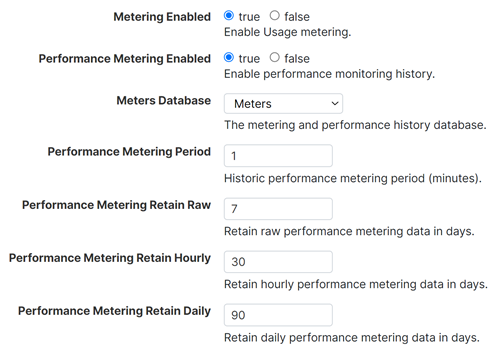
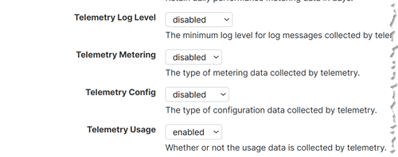
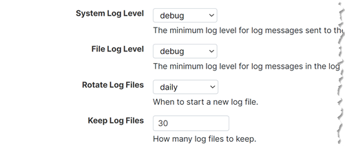
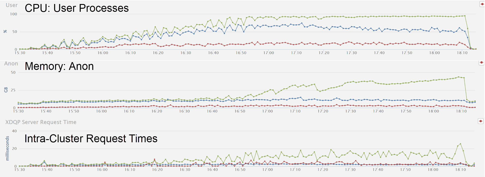

## **LUX Backend Infrastructure**

- [Introduction](#introduction)
- [Backups](#backups)
  - [Distilled Advise](#distilled-advise)
  - [Configuring Scheduled Backups](#configuring-scheduled-backups)
  - [Helper Scripts](#helper-scripts)
- [System Monitoring](#system-monitoring)
  - [Features](#features)
  - [Distilled Advise](#distilled-advise-1)
    - [Emerging Recommendations](#emerging-recommendations)
    - [Management API Recommendations](#management-api-recommendations)
    - [Log File Recommendations](#log-file-recommendations)
      - [System Log Files](#system-log-files)
      - [Application Server Log Files](#application-server-log-files)
    - [Forest Reserve Requirement](#forest-reserve-requirement)
  - [Feature Configuration](#feature-configuration)
    - [Monitoring History Group Level Settings](#monitoring-history-group-level-settings)
    - [Telemetry Group Level Settings](#telemetry-group-level-settings)
    - [Log Group Level Settings](#log-group-level-settings)
- [Performance Issues](#performance-issues)
  - [Uneven System Resource Utilization](#uneven-system-resource-utilization)

# Introduction

While incomplete, this document contains infrastructure topics documented thus far.  There is additional documentation that could arguably be consolidated herein, including [LUX Backend Security and Software](/docs/lux-backend-security-and-software.md).  Over time, we hope to see additional topics added, such as High Availability (LUX already utilizes AWS auto-scaling and MarkLogic forest-level failover).  Feel free to help us make this documentation more valuable!

# Backups

## Distilled Advise

1. Backup every database each content database is dependent on: security, schema, and triggers.  For a content database to be available, all dependent databases must also be available.
2. Application servers are dependent on content and modules databases.  Decide if you would prefer to recover or re-deploy modules databases during a recovery.  If the former, add modules databases the list of databases to backup.
3. Backup the App-Services database.  It contains everyone's Query Console workspaces.
4. Weekly full backups and daily incremental backups are a good default.  When requirements and circumstances necessitate more, consider incremental backups no more frequent than every fours hours, with journal archiving enabled.
5. When there are multiple databases configured to backup a shared security, schema, or triggers database, either a) avoid their backup jobs from overlapping, b) only have one content database's backup job include the shared databases or c) configure dedicated backup schedules for the shared databases and exclude them from the content database backups.  Else, one backup job may fail as the same database cannot be backed up at the same time.  When a backup job fails, all databases associated to the failed backup job are not backed up.
6. Verify backup jobs were successful, using automated system monitoring.  This is also mentioned in the [distilled system monitoring advice](#distilled-advise-1).
7. Triple check the Security database is being successfully backed up.
8. Be familiar with the latest [Notes about Backup and Restore Operations](https://docs.marklogic.com/guide/admin-guide/en/backing-up-and-restoring-a-database/backup-and-restore-overview/notes-about-backup-and-restore-operations.html).
9. If inclined to vary from the above advise and/or have additional questions, please refer to:
    * [MarkLogic Backup/Restore FAQ](https://help.marklogic.com/Knowledgebase/Article/View/marklogic-backuprestore-faq).  Among other points, this KB article lists advantages of using MarkLogic to create backups.
    * The [Backing Up and Restoring a Database](https://docs.marklogic.com/11.0/guide/admin-guide/en/backing-up-and-restoring-a-database.html) section of the MarkLogic Admin Guide.

## Configuring Scheduled Backups

Backup schedules are specified in the content database's ML Gradle configuration file.  The primary database's configuration file is [src/main/ml-config/base/databases/content-database.json](/src/main/ml-config/base/databases/content-database.json).  The `mlDeployDatabases` ML Gradle task deploys the database configuration --note this task also deploys the database's index configuration, resulting in a re-indexing job _only when_ the provided configuration differs from the deployed configuration.

Deployed backup schedules may be reviewed from within the MarkLogic admin interface: Admin -> Databases -> [database name] -> Backup/Restore.  One may also do so by retrieving the database's configuration via `/manage/v2/databases/[database-name]/properties`, which is included in the project's [Postman setup](/docs/lux-postman-workspace.md).

## Helper Scripts

Backup-related helper scripts may be found within [/scripts/backups](/scripts/backups).  Please test in pre-production environments before use in a production environment.

Script descriptions:

* backup-schedule-report.js: Create a report of every database's backup schedules.  Also identifies databases that do not have a backup schedule.  Could be utilized by a system monitoring test.
* set-backup-schedules.js: Replace the backup schedules of one or more databases.  Geared towards a weekly full and daily incremental backups, and to stagger the start times in an attempt to reduce/avoid overlapping backup jobs.
* validate-ability-to-restore.js: Reports MarkLogic's determination on whether the specified backup may be used.

# System Monitoring

MarkLogic provides an extensive [System Monitoring Guide](https://docs.marklogic.com/guide/monitoring).  Documentation herein serves as a summary of available monitoring tools and distilled advice.  For additional details, please refer to the monitoring guide and KB articles, including [Basic MarkLogic Server Monitoring Guidelines](https://help.marklogic.com/Knowledgebase/Article/View/31/19/basic-marklogic-server-monitoring-guidelines).

## Features

MarkLogic-provided monitoring features enable system administrators to manually monitoring MarkLogic and tie into enterprise system monitoring tools to automate the monitoring.  Further, one feature is geared towards better enabling MarkLogic Support to respond to an event.

Features:

1. MarkLogic Server Monitoring Dashboard: provides real-time system resource utilization information and is available at http://[host]:8002/dashboard by default.
2. MarkLogic Server Monitoring History: provides historical system resource utilization information and is available at http://[host]:8002/history by default.  The historical information rotates out, and is configurable at the group level.  See [Monitoring History Group Level Settings](#monitoring-history-group-level-settings).
3. When telemetry is enabled, system data is automatically and periodically made available to MarkLogic Support.  This serves as proactive means to make system configuration and logs available to MarkLogic Support, as opposed to doing so after an event.  Note that this feature does *not* transmit application server logs given they may contain sensitive data (e.g., PII data).  Here too there are group level settings; see [Telemetry Group Level Settings](#telemetry-group-level-settings).  Telemetry is disabled by default.  See [Emerging Recommendations](#emerging-recommendations).
4. Management API: An extensive API capable of configuring and serving up various statuses of MarkLogic environments.  Many ML Gradle tasks consume the configuration portion of the Management API while enterprise system monitoring tools consume the status portion of the API --using a service account with less privileges than required by ML Gradle.  While extensive, there are times when it makes sense to supplement Management API-based tests with custom endpoints; examples include application-specific monitoring tests and multi-tenancy deployments.  See [Management API Recommendations](#management-api-recommendations).
5. Logs: Log files contain a wealth of information --some of which is critical to system monitoring.  Log files may be retrieved using the Management API* or directly from the file system.  The `manage/v2/logs` endpoint accepts host, start, end, and regex parameters.  Another approach is to copy the logs from all MarkLogic nodes to a log monitoring server capable of alerting system administrators based on log level and string matching.  See [Log Group Level Settings](#log-group-level-settings), [Emerging Recommendations](#emerging-recommendations), and [Log File Recommendations](#log-file-recommendations).

Alerting, scheduled tasks, document events, and the Content Processing Framework are additional MarkLogic features that *could* be used for system monitoring purposes.  While not typical, there may be scenarios where they are preferred.

## Distilled Advise

### Emerging Recommendations

* Always enable telemetry.
* Set the log level to debug, even in production environments.

### Management API Recommendations

Use the Management API (or custom endpoints) to:

* Verify all hosts are available/online.
* Verify required app servers are available.
* Verify required databases are available
* Verify last full and incremental backups for required databases are recent enough (e.g., seven or less days for a full and up to day for incremental)
* Verify there is sufficient disk reserve on all forest-bearing volumes.  See [Forest Reserve Requirement](#forest-reserve-requirement).
* Verify there is sufficient disk space for the logs (all nodes)
* Monitor for forests that have failed over.

### Log File Recommendations

Log file contents vary by MarkLogic node; thus, logs from all MarkLogic nodes are to be monitored.

Start with the system logs as they cover MarkLogic cluster issues.  Move on to application server logs once system logs are sufficient covered.

Once log monitoring is set up, one may find it easier to implement some of the tests listed in the [Management API Recommendations](#management-api-recommendations) easier to implement via log monitoring.  Nothing wrong with that.

If log file encryption is enabled, MarkLogic offers a command line tool to decrypt the logs: `mlecat`.

#### System Log Files

Broadly speaking, monitor for all messages in ErrorLog.txt with log level of Warning or greater.

Target the following, which are listed in [Are There Signs of a Serious Problem?](https://docs.marklogic.com/guide/monitoring/intro#id_15703):

* Repeated server restart messages
* XDQP disconnect
* Forest unmounted (OK when the ML process is stopped on purpose)
* System-level errors: SVC-*
* Serious internal error conditions: XDMP-BAD

After sufficient coverage of ErrorLog.txt, consider monitoring other system log files:

| Log Filename Pattern | Purpose  |
|---|---|
| AuditLog.txt | Logs enabled audit events. |
| CrashLog.txt | CrashLog.txt is populated with information useful to support in the event of a Segmentation or similar fault.  It is copied to ErrorLog.txt and cleared immediately when restarting after a crash.  |
| TaskServer_*.txt | Task server’s request and error logs.  Note that the use of the task server is quasi discouraged as it offers no persistence in the case of a restart or outage.  |

#### Application Server Log Files

Once content with your system log monitoring coverage, move on to your application log files.  Ports shown in the log filename pattern are defaults.

| Log Filename Pattern | Purpose  |
|---|---|
| 7997_*.txt | Intra-cluster and health check access, request, and error logs.  |
| 8000_*.txt | App-Services access, request, and error logs.  May include deployment activity.  |
| 8001_*.txt | Admin Console access, request, and error logs.  |
| 8002_*.txt | Manage access, request, and error logs.  May include deployment activity.  |
| [port]_*.txt | The balance of port-specific log files are likely those of specific applications.  Their access, request, and error logs could be monitored.  Application error logs could be monitored for messages written by custom code.  LUX utilizes trace events to conditionally emit such messages; for more on LUX's trace events, see the [Trace Events](/docs/lux-backend-deployment.md#trace-events) section of the deployment documentation. |

### Forest Reserve Requirement

From [ML 11.3.0's release notes](https://docs.progress.com/bundle/marklogic-server-whats-new-11/page/topics/other-notes/memory-and-disk-space-requirements.html):

> MarkLogic Server requires 1.5 times the disk space of the total forest size. Specifically, each forest on a filesystem requires its filesystem to have at least 1.5 times the forest size in disk space (or, for each forest less than 48 GB, 3 times the forest size) when the merge max size database merge setting is set to the default of 48 GB. This translates to approximately 1.5 times the disk space of the source content after it is loaded. For example, if you plan on loading content that will result in a 200 GB database, reserve at least 300 GB of disk space. The disk space reserve is required for merges.

Based on the above, LUX using the default merge max size of 48 GB and its forests being larger than 48 GB, LUX's forest reserve should be 1.5 times the sum of all forests on the volume (primary and replica).  Applying that to the 2024-12-14 dataset that had about 210 GB of primary forest data on each node and no replicated forests, the reserve would be 315 GB, meaning the volume would need to be 525 GB before accounting for journals, logs, and anything else on the same volume.

`525 GB volume size = 210 GB forest data + (1.5 x 70 GB forest size x 3 forests per volume)`

For environments that replicate the forest data once:

`1,050 GB = 420 GB forest data + (1.5 x 70 GB forest size x 6 forests per volume)`

But the notes also state:

> You need at least 2 times the merge max size of free space per forest, regardless of the forest size. Therefore, with the default merge max size of 48 GB, you need at least 96 GB of free space. Additionally, if your journals are not yet created, you need 2 times the journal size of free disk space (if the journal space is not yet allocated). Therefore, to be safe, you need (with the default merge max size and a 2G journal size) at least 100 GB of free space for each forest, no matter what size the forest is.

That would change the reserve to 300 GB, which is not much different given LUX's cited average forest size.  Unlike the first calculation, this includes 4 GB per forest for journals.

`510 GB volume size = 210 GB forest data + (100 GB minimum per forest x 3 forests per volume)`

For environments that replicate the forest data once:

`1,020 GB = 420 GB forest data + (100 GB minimum per forest x 6 forests per volume)`

Okay, so if we go with the more conservative formula, let's account for journals and logs.

| Data              | Not Replicated | Unit | Replicated Once | Unit | Notes           |
|-------------------|----------------|------|-----------------|------|-----------------|
| Primary forests   | 210            | GB   | 210             | GB   |                 |
| Replicated forest | 0              | GB   | 210             | GB   |                 |
| Forest reserve    | 315            | GB   | 630             | GB   |                 |
| Journals          | 12             | GB   | 24              | GB   | 4 GB per forest |
| Logs              | 2              | GB   | 2               | GB   | 30 days of logs |
| Totals            | 539            | GB   | 1076            | GB   |                 |

TBD the degree in which embedded vectors may impact the above.

## Feature Configuration

### Monitoring History Group Level Settings

### Telemetry Group Level Settings

### Log Group Level Settings

# Performance Issues

Various techniques can help when investigating a performance issue.  Below is not yet an attempt to compile all techniques.  Rather, it starts with a specific scenario: nodes that are both evaluator and data nodes are utilizing different levels of system resources.

## Uneven System Resource Utilization

Upon reviewing a performance test's results, we noticed system resource utilization unexpectedly varied by node, illustrated here:

While a root cause was not identified, the following table includes what was considered and may provide future value.

*Note to authors: edit this table in [/docs/lux-markdown-tables.xlsx](/docs/lux-markdown-tables.xlsx) then paste herein as Markdown, using the likes of the [Excel to Markdown table VS Code extension](https://marketplace.visualstudio.com/items?itemName=csholmq.excel-to-markdown-table).*

| Action                                                                                                                                                                 | How                                                                                                                                                                                                                                                                                                                                                                                                                                |
|------------------------------------------------------------------------------------------------------------------------------------------------------------------------|------------------------------------------------------------------------------------------------------------------------------------------------------------------------------------------------------------------------------------------------------------------------------------------------------------------------------------------------------------------------------------------------------------------------------------|
| Consider opening a MarkLogic Support ticket.                                                                                                                           | [MarkLogic Support Portal](https://help.marklogic.com/)                                                                                                                                                                                                                                                                                                                                                                            |
| If the incident is presently happening, review the information available in the MarkLogic Monitoring Dashboard                                                         | http[s]://[hostname]:8002/dashboard.  Available information includes the longest running queries.                                                                                                                                                                                                                                                                                                                                  |
| Review information available in the MarkLogic Monitoring History Console and --if still incident is ongoing-- the Dashboard.                                           | http[s]://[hostname]:8002/history.  As the top-level charts can be the sum of all nodes, click into each category to access node-specific details and additional charts.  Available information includes IO wait time, swap, HTTP request counts, XQDP request counts, XQDP response times, and more.                                                                                                                              |
|                                                                                                                                                                        |                                                                                                                                                                                                                                                                                                                                                                                                                                    |
| Verify the load balancer is distributing the requests evenly (roughly).                                                                                                | [Collect](/scripts/logAnalysis/collectBackendLogs.sh) the access and request logs from all nodes, [trim](/scripts/logAnalysis/trimBackendLogs.sh) to the period of interest, then count the lines (`wc -l *RequestLog*txt`).                                                                                                                                                                                                       |
| Verify each node is hosting the same number of primary forests, for the content database.  When true, the same should be true for the same database's replica forests. | Open the Forest Summary page, in the MarkLogic Admin Console.  Review the forest statuses.  Primary forests are those with a status of "open".  Replica forests are those with a status of "sync-replicating".  Other forest statuses exist and do not necessarily indicate an issue; for more information on possibly statues/states, refer to [Forest Mount States](https://docs.marklogic.com/guide/cluster/failover#id_79731). |
| Compare findings to OS-level metrics; gleam additional insights.                                                                                                       | Review `sar` or other OS-level system resource metrics, if available.                                                                                                                                                                                                                                                                                                                                                              |
| Consider cycling out one or more ec2 instances for new ones, on the small-yet-present chance underlying infrastructure is impacting a node's performance.              | In the AWS console, stop the ec2 instance and allow auto-scaling to replace it.  Check forest failover status once the cluster is whole again.                                                                                                                                                                                                                                                                                     |